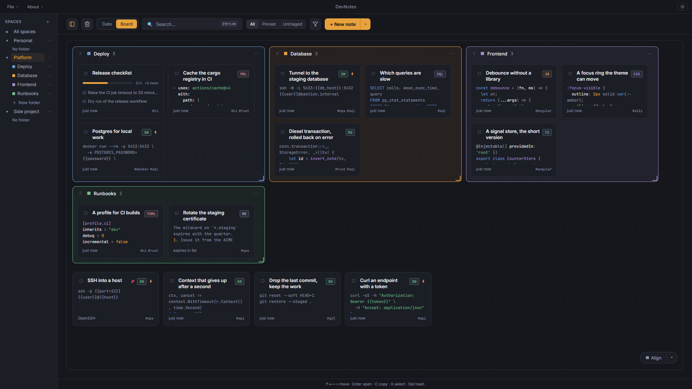

<div align="center">

# DevNotes

**Your snippets, one shortcut away.**

An encrypted, local-first notes and snippets manager for developers.<br>
Write a command once, find it in a keystroke, paste it anywhere.

[](https://github.com/vmillet-dev/devnotes-rs/releases/latest)
[](https://github.com/vmillet-dev/devnotes-rs/actions/workflows/ci.yml)
[](#install)
[](LICENSE)

[**Download**](https://github.com/vmillet-dev/devnotes-rs/releases/latest) · [Code quality](#code-quality) · [Features](#features) · [Security](#security) · [Build from source](#build-from-source)

</div>

<br>



<table>
<tr>
<td width="33%" valign="top">

### Paste from anywhere

`Ctrl+Alt+P` opens the palette over whatever you are doing. Find the snippet, fill in its `{{fields}}`, and `Ctrl+C` puts it on the clipboard while the window steps aside.

</td>
<td width="33%" valign="top">

### Private by design

Everything stays on your machine, sealed with a passphrase only you know. No account, no cloud, no telemetry, and it works with the network off.

</td>
<td width="33%" valign="top">

### Organised your way

Spaces, folders and tags. Browse notes by date or lay them out on a board. The keyboard reaches everything, and the mouse works too.

</td>
</tr>
</table>

## Code quality

Every change goes through Rust and front-end unit tests, end-to-end tests on Windows and Linux against the built application, `clippy` in pedantic mode, ESLint, and a SonarCloud quality gate on each half.

| Code base               | SonarCloud                                                                                                                                                                                                                                                                                                                                                                                                                                                                                                                                                                                                                                                                                                                                                                                                                                                                                                                                                                                                                                                                                                                                                |
| ----------------------- | --------------------------------------------------------------------------------------------------------------------------------------------------------------------------------------------------------------------------------------------------------------------------------------------------------------------------------------------------------------------------------------------------------------------------------------------------------------------------------------------------------------------------------------------------------------------------------------------------------------------------------------------------------------------------------------------------------------------------------------------------------------------------------------------------------------------------------------------------------------------------------------------------------------------------------------------------------------------------------------------------------------------------------------------------------------------------------------------------------------------------------------------------------- |
| **Back end** — Rust     | [](https://sonarcloud.io/summary/overall?id=devnotes-rust) [](https://sonarcloud.io/component_measures?id=devnotes-rust&metric=coverage) [](https://sonarcloud.io/component_measures?id=devnotes-rust&metric=ncloc) [](https://sonarcloud.io/component_measures?id=devnotes-rust&metric=sqale_rating) [](https://sonarcloud.io/component_measures?id=devnotes-rust&metric=reliability_rating) [](https://sonarcloud.io/component_measures?id=devnotes-rust&metric=security_rating)             |
| **Front end** — Angular | [](https://sonarcloud.io/summary/overall?id=devnotes-front) [](https://sonarcloud.io/component_measures?id=devnotes-front&metric=coverage) [](https://sonarcloud.io/component_measures?id=devnotes-front&metric=ncloc) [](https://sonarcloud.io/component_measures?id=devnotes-front&metric=sqale_rating) [](https://sonarcloud.io/component_measures?id=devnotes-front&metric=reliability_rating) [](https://sonarcloud.io/component_measures?id=devnotes-front&metric=security_rating) |

## Features

| Feature               | What it gives you                                                                                                               |
| --------------------- | ------------------------------------------------------------------------------------------------------------------------------- |
| **Quick paste**       | `Ctrl+Alt+P` from any application: search, `Ctrl+C` copies, `Enter` opens the note                                              |
| **`{{fields}}`**      | `ssh -p {{port=22}} {{user}}@{{host}}` asks for its values before it reaches the clipboard, with defaults you set once          |
| **Search**            | titles, bodies, list items and tags, accents folded, and each card quotes the line that matched                                 |
| **Board and folders** | a space laid out as a board where folders are regions, or listed by date                                                        |
| **Keyboard first**    | arrows to move, `Enter` to open, `C` to copy, `P` to pin, `X` to select, `Del` to trash, `Ctrl+Z` to undo                       |
| **Todo lists**        | a second kind of note: an ordered list you tick off                                                                             |
| **History**           | the last twenty versions of a snippet, one click from coming back                                                               |
| **Trash and undo**    | a deletion is undone at once, or brought back within 30 days                                                                    |
| **Bulk actions**      | select several notes, then move, file, tag, export or trash them together                                                       |
| **Tags**              | rename, merge or drop a tag across the whole library                                                                            |
| **Attachments**       | drop a file or paste an image; preview it, open it, save it elsewhere                                                           |
| **Several libraries** | work and personal kept apart, each behind its own passphrase                                                                    |
| **Import and export** | a `.devnotes` archive with the attachments, optionally sealed with a passphrase of its own; or the selection copied as Markdown |
| **Backups**           | a rolling copy at launch, restored in two clicks from Preferences → Security                                                    |
| **Look and feel**     | light and dark themes, a compact density, English and French, eighteen languages highlighted                                    |

## Install

DevNotes runs on **Windows** and **Linux**. Get it from the [latest release](https://github.com/vmillet-dev/devnotes-rs/releases/latest); after that, updates are offered inside the application.

| Platform | File                                | Pick it if                                       |
| -------- | ----------------------------------- | ------------------------------------------------ |
| Windows  | `devnotes_<version>_x64-setup.exe`  | you just want it installed — **the one to take** |
| Windows  | `devnotes_<version>_x64_en-US.msi`  | you deploy software through group policy         |
| Windows  | `devnotes-<version>-windows.exe`    | you want no installer at all                     |
| Linux    | `devnotes_<version>_amd64.AppImage` | any distribution, nothing to install             |
| Linux    | `devnotes_<version>_amd64.deb`      | Debian, Ubuntu and derivatives                   |
| Linux    | `devnotes-<version>-1.x86_64.rpm`   | Fedora, RHEL and derivatives                     |
| Linux    | `devnotes-<version>-linux`          | the bare executable                              |

```bash
chmod +x devnotes_*_amd64.AppImage        # then launch it
sudo apt install ./devnotes_*_amd64.deb   # Debian and Ubuntu
sudo dnf install ./devnotes-*.x86_64.rpm  # Fedora and RHEL
```

<details>
<summary><strong>Windows shows a SmartScreen warning the first time</strong></summary>

<br>

Choose **More info**, then **Run anyway**. The warning is about the publisher's identity, not the file: DevNotes has no code-signing certificate. Its updates are signed with minisign and verified before they install, and every release publishes `SHA256SUMS.txt`.

</details>

<details>
<summary><strong>Why there is no macOS build</strong></summary>

<br>

It cannot be tested here, and Gatekeeper wants a paid Apple Developer account with no free way around it on recent versions. Shipping for a platform that can be neither tested nor distributed would be a promise nobody can keep.

</details>

## Security

DevNotes asks for a passphrase the first time it runs, and once at every launch after that. The passphrase opens the library and is never stored anywhere — not in a keychain, not behind a "remember me".

| Aspect             | How                                                                                                                                                     |
| ------------------ | ------------------------------------------------------------------------------------------------------------------------------------------------------- |
| **Sealed on disk** | titles, bodies, sources and their history, list items, space and folder names, `{{field}}` values, attachment names and the attachment files themselves |
| **Key derivation** | Argon2id (64 MiB, 3 passes) over a random salt. The passphrase wraps the library key rather than being it, so changing it re-encrypts nothing           |
| **Encryption**     | AES-256-GCM with a fresh nonce per write; a tampered value is refused, never decrypted into nonsense                                                    |
| **Passphrase**     | at least twelve characters. Several unrelated words hold far better than one clever word with a digit in it                                             |
| **Exports**        | the one file meant to travel gets a passphrase of its own, or is written in the clear if you say so                                                     |

> [!WARNING]
> **There is no recovery.** No account, no escrow, no reset: a lost passphrase is a lost library. An export written in the clear is the only copy that does not depend on it.

<details>
<summary><strong>What a stolen file still gives away</strong></summary>

<br>

What SQL filters, sorts and joins on is not sealed — sealing it would mean loading the whole library to answer a query. Without the passphrase, whoever holds your files cannot read a title, a body or an attachment, but they can read:

- how many notes there are, and how they hang in spaces and folders — the shape, not the names;
- when each note was created, changed, trashed or given a deadline, and whether it is pinned;
- each note's language and kind, how many items a list holds and which are ticked;
- every tag and every `{{field}}` name, as typed — `prod`, `aws`, `client-acme`, `db_password`;
- the length of every sealed value: AES-GCM hides what a title says, not how long it is;
- each attachment's type and size, the names of your libraries, and your preferences.

Keep that in mind before a tag or a field name carries the secret itself.

</details>

<details>
<summary><strong>What lives in memory while it runs</strong></summary>

<br>

The key, for the length of the session: there is no idle re-lock. And your notes, decrypted as they are read — a search reads the bodies it matches against, and the interface holds the first lines of every card on screen and the whole of the note you open. None of it is wiped when it is let go, so it can reach the swap file, a hibernation image or a crash dump. DevNotes protects files at rest — a stolen laptop, a copied profile — not a machine already compromised while it runs.

Opening an attachment writes a decrypted copy inside your own profile, never the shared temporary folder, because the program that opens it reads from disk. Those copies are deleted when DevNotes quits, and whatever survived is swept at the next launch.

</details>

## Your data

A library is a folder of your profile, and it is worth knowing where:

| Platform    | Folder                             |
| ----------- | ---------------------------------- |
| **Windows** | `%APPDATA%\com.devnotes.app\`      |
| **Linux**   | `~/.local/share/com.devnotes.app/` |

Each library lives in `libraries/<id>/`: the database, `vault.json` — the key file your passphrase opens — its attachments, and its backups. `libraries.json` lists your libraries and `preferences.json` holds the application's settings.

> [!IMPORTANT]
> The database and `vault.json` only mean anything together. Copy one without the other and you have copied something nobody can open again.

**Backups.** A rolling copy is taken at launch, at most one a day, and the last three are kept in `backups/`: database, key file and attachments together, restored in two clicks from Preferences → Security. The attachments are hard-linked rather than duplicated, so a copy costs little more than the notes. These copies sit next to the original, which is the accident they cover — an emptied trash, a botched update. For a dead disk, export somewhere else.

**Integrity.** The database is checked every time a library opens. If it is damaged, DevNotes says so instead of starting on it, and offers to set it aside with whatever could still be rescued; your passphrase does not change.

## Built with

| Layer            | Technology                                                                                        |
| ---------------- | ------------------------------------------------------------------------------------------------- |
| **Front end**    | Angular 22 — standalone components, signals, zoneless change detection                            |
| **Native shell** | Rust and Tauri v2                                                                                 |
| **Storage**      | SQLite through Diesel, values sealed with AES-256-GCM                                             |
| **Boundary**     | the IPC surface is generated from the Rust signatures, so both sides compile against one contract |

## Build from source

You need Node.js 24 (pinned in `.nvmrc`), Rust through `rustup`, and [Tauri's system dependencies](https://tauri.app/start/prerequisites/) for your OS.

```bash
npm install
npm run tauri dev
```

Front-end changes hot-reload; Rust changes trigger a slower automatic recompile. [CONTRIBUTING.md](CONTRIBUTING.md) has the rest: every script, what CI checks, and the conventions that are load-bearing.

## Documentation

| Document                             | What it covers                                                                            |
| ------------------------------------ | ----------------------------------------------------------------------------------------- |
| [Contributing](CONTRIBUTING.md)      | building, testing, what CI checks, and the conventions the compiler cannot enforce        |
| [Architecture](docs/architecture.md) | the structure of both halves, state and data access, the Angular ↔ Rust boundary, testing |
| [Releasing](docs/releasing.md)       | how a version is cut, and how release notes are sorted                                    |
| [Changelog](CHANGELOG.md)            | what changed, and when                                                                    |

## License

DevNotes is free software under the [GNU General Public License v3.0](LICENSE): use it, study it, share it and change it, and a distributed fork stays under the same terms and ships its source. Opening a pull request means you agree to have your work distributed under the GPL-3.0.
